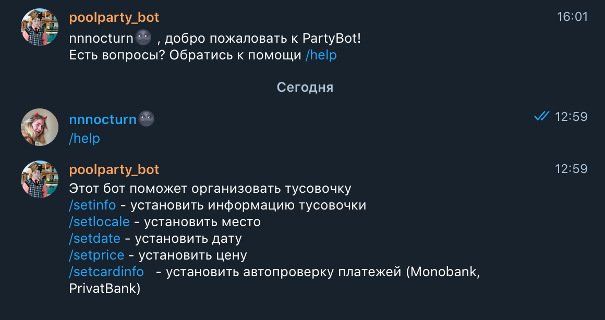
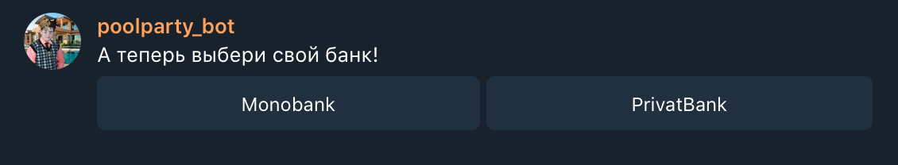
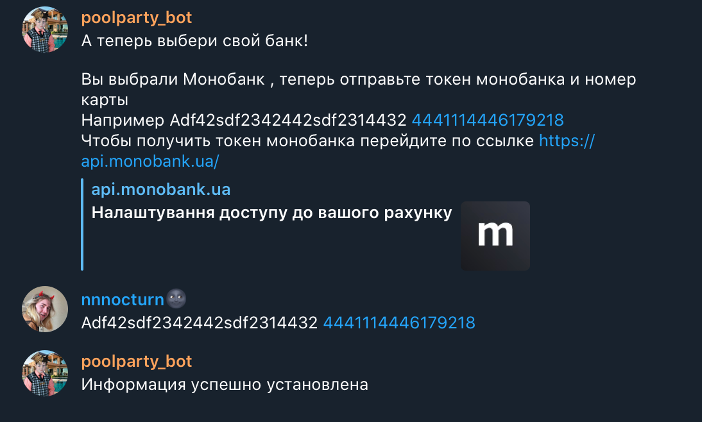
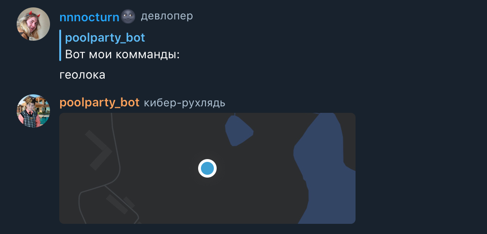
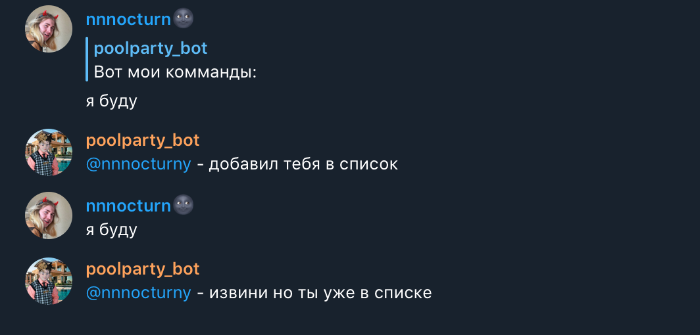
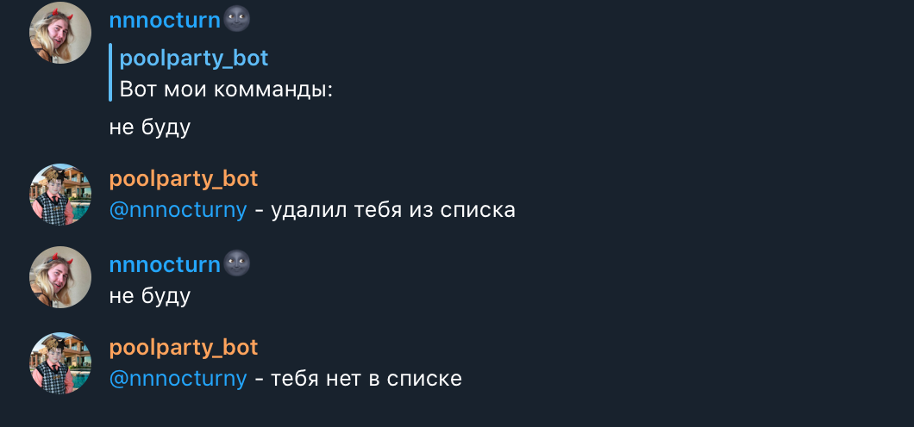
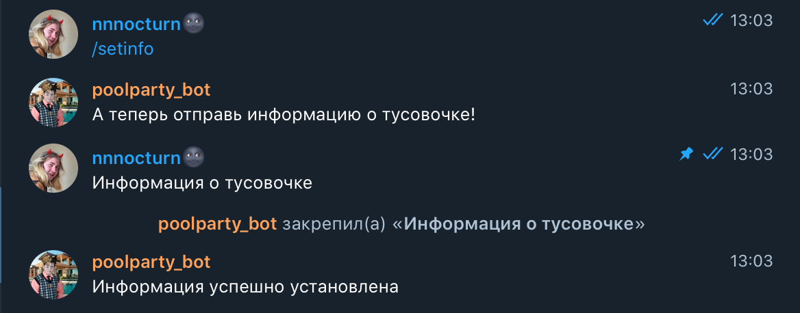
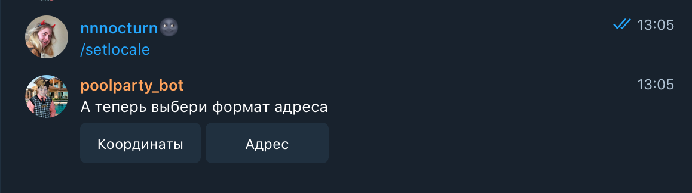
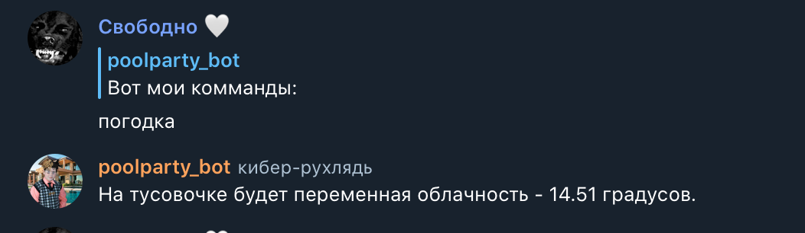
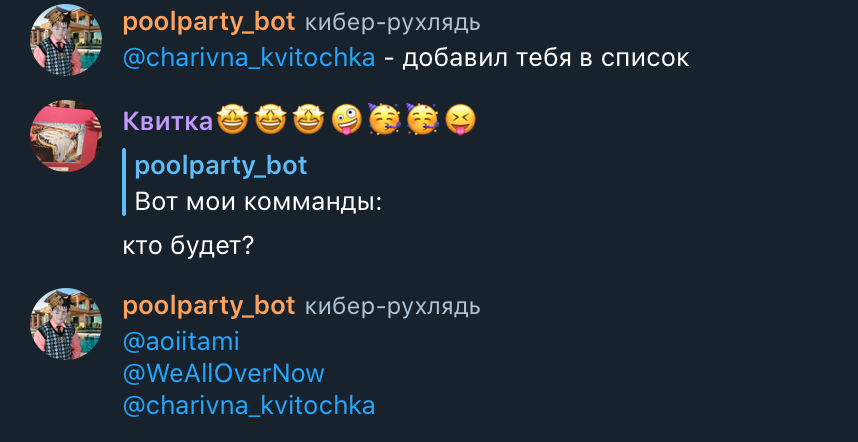

# Partybot
Telegram bot to party organization automation
## Implementation:
PostgreSQL, Aiogram
## Specification:
### Admin Command
1./setinfo - установить информацию тусовочки
2./setlocale - установить место
3./setdate - установить дату
4./setprice - установить цену
5./setcardinfo   - установить автопроверку платежей (Monobank, PrivatBank)
6./delete {nickname} - удалить человека из списка
### User Command
1.Погодка - узнать погоду на тусовочке (доступна за 5 дней)
2.Инфо - узнать информацию о тусовочке 
3.Геолока - узнать расположение тусовочки
4.Цена - узнать цену тусовочки
5.Бюджет - узнать сколько денег уже есть в казне тусовочки
6.Дата - узнать дату тусовочки
7.(Я буду,кто будет?, не буду) - комманды для добавления/удаления со списка
8.Оплатить - оплатить проходку на тусовку
## View:

