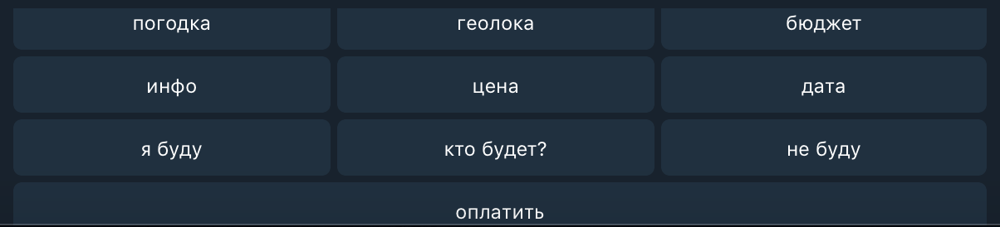
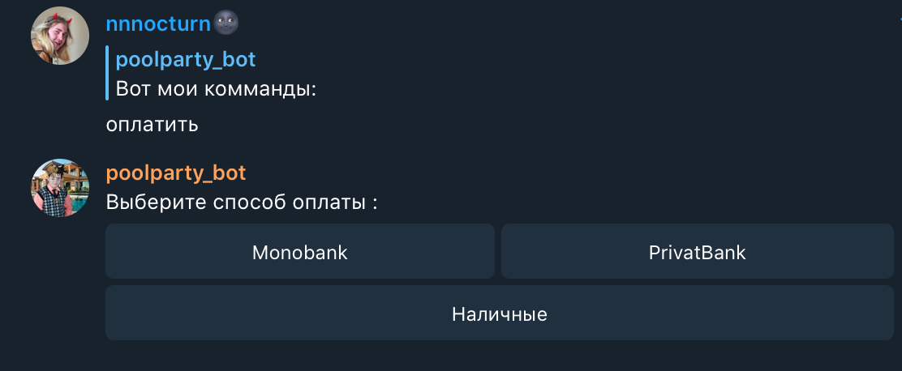

# Partybot
Telegram bot to party organization automation
## Implementation:
PostgreSQL, Aiogram
## Specification:
### Admin Command
/setinfo - установить информацию тусовочки
/setlocale - установить место
/setdate - установить дату
/setprice - установить цену
/setcardinfo   - установить автопроверку платежей (Monobank, PrivatBank)
/delete {nickname} - удалить человека из списка
### User Command
Погодка - узнать погоду на тусовочке (доступна за 5 дней)
Инфо - узнать информацию о тусовочке 
Геолока - узнать расположение тусовочки
Цена - узнать цену тусовочки
Бюджет - узнать сколько денег уже есть в казне тусовочки
Дата - узнать дату тусовочки
(Я буду,кто будет?, не буду) - комманды для добавления/удаления со списка
Оплатить - оплатить проходку на тусовку
## View:

